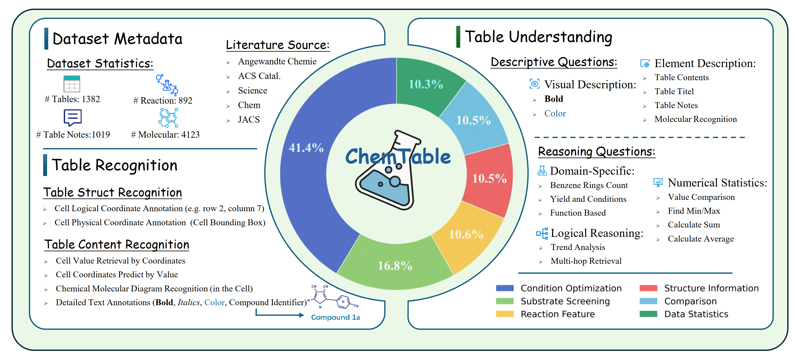
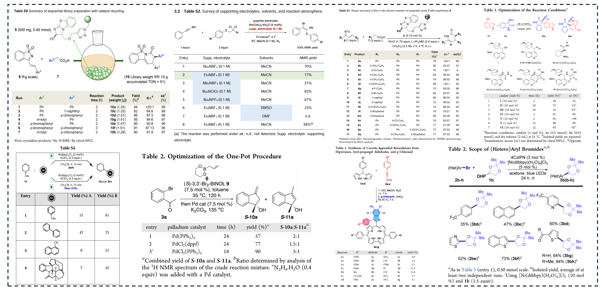
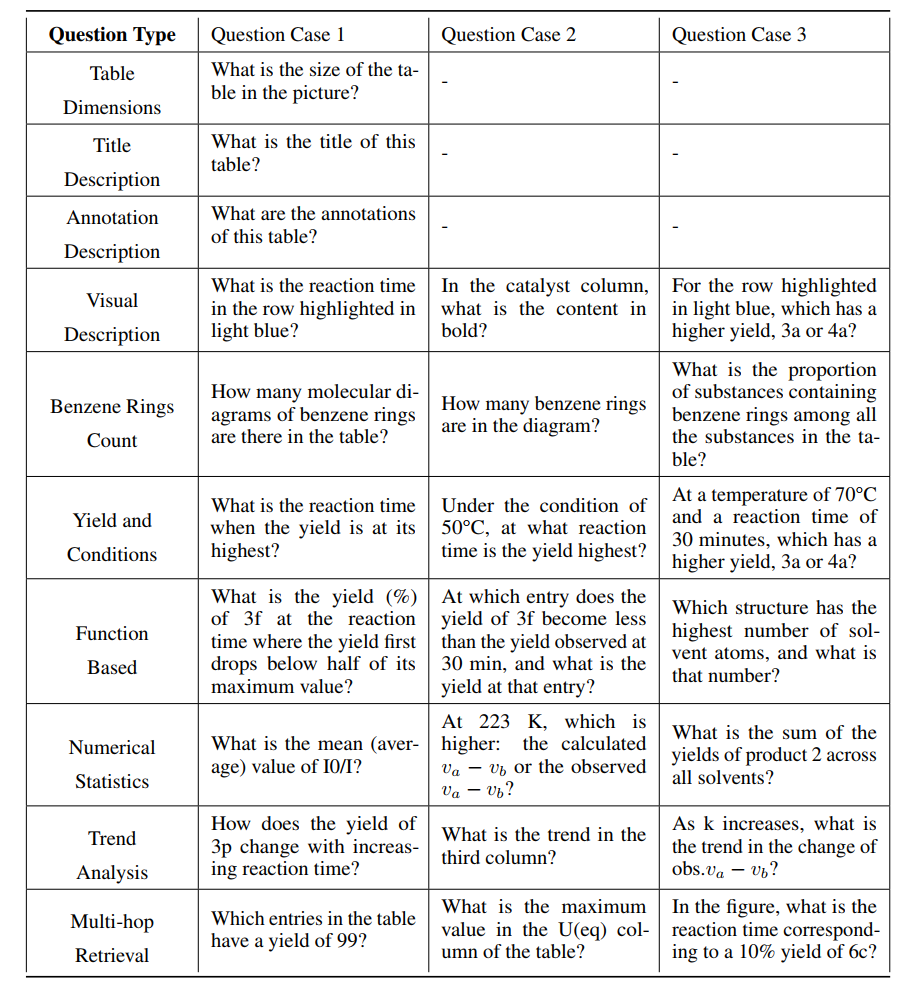
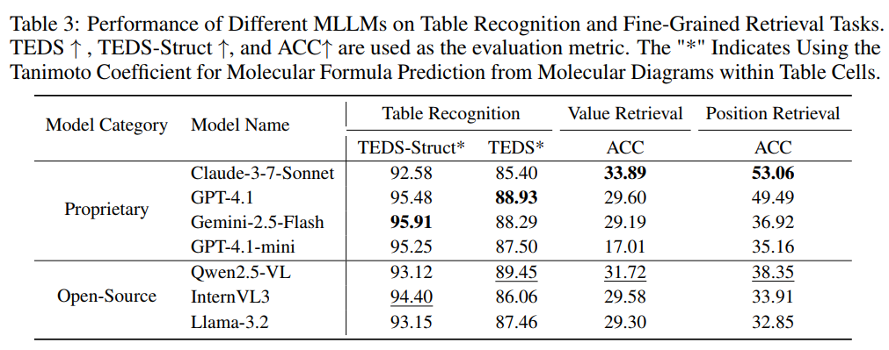
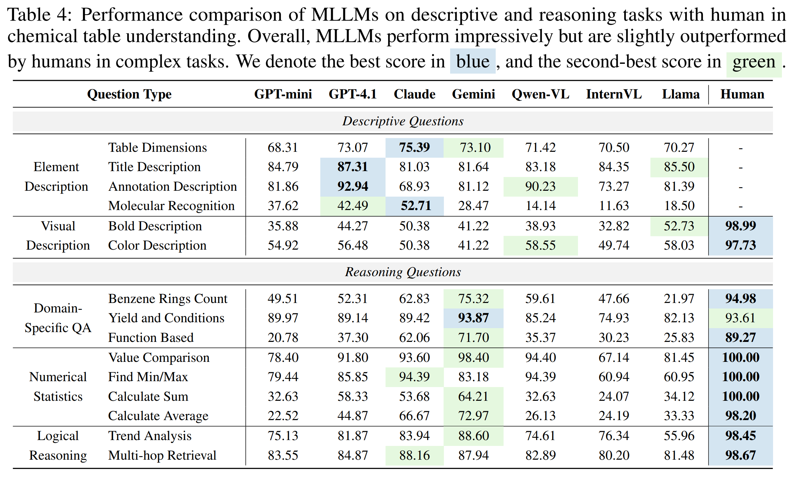

# 🧪 ChemTable: Benchmarking Multimodal LLMs on Recognition and Understanding over Chemical Tables


ChemTable is a large-scale benchmark designed to test the capabilities of multimodal large language models (MLLMs) in understanding **real-world chemical tables**—one of the most information-dense and visually complex formats in scientific literature.




> 📘 Built from over 1,300 tables from high-impact chemistry journals, ChemTable combines **visual, textual, symbolic**, and **domain-specific** information to push the boundaries of scientific AI.

---

## 🚀 Key Features

- **Multimodal Benchmark**  
  Combines symbolic chemical formulas, table structures, visual molecule diagrams, and scientific text.

- **Two Core Tasks**  
  1. **Table Recognition**: Detect structure, extract content, and identify molecules.  
  2. **Table Understanding**: Answer descriptive and reasoning-based questions from tables.

- **Challenging QA Dataset**  
  Includes 9,000+ questions (descriptive + reasoning), curated with a mix of human annotation and LLM-assisted synthesis.

---

## 🧩 Dataset Structure



- **Table Types**: Reaction optimization, substrate screening, property comparison, molecular structure tables, and more.
- **Visual Annotations**: Bounding boxes, styles (bold/color), molecule diagrams.
- **Logical Annotations**: Row/column positions, cell values, chemical metadata.

---

## 🏗️ Tasks

### 📐 Table Recognition
| Subtask               | Description                                        | Metric     |
|----------------------|----------------------------------------------------|------------|
| Value Retrieval       | Locate exact content at given (row, column)       | Accuracy   |
| Position Retrieval    | Infer position from given content                 | Accuracy   |
| Molecular Recognition | Identify SMILES from embedded diagrams            | Tanimoto   |


### 🤖 Table Understanding



---

## 🔬 Experimental Results




---

## 🛠️ Getting Started

### Dataset

The dataset is available at [HuggingFace Datasets](https://huggingface.co/datasets/ustc-zyt/ChemTable). You can download it directly or use the Hugging Face Datasets library:

```python
from datasets import load_dataset
dataset = load_dataset("ustc-zyt/ChemTable")
```

### Evaluation Scripts

The `eval/` directory contains evaluation scripts organized by tasks:

- `smiles_eval.py`: Molecular structure recognition evaluation
- `TR_eval.py`: General table structure recognition evaluation
- `benzene_ring_eval.py`: Specific evaluation for benzene ring detection
- `evaluate_table_qa.py`: General QA evaluation
- `visual_reasoning_eval.py`: Visual reasoning capability evaluation
- `logical_reasoning_trend_eval.py`: Logical reasoning evaluation
- `multihop_reference_eval.py`: Multi-hop reasoning evaluation

Each script can be run independently and includes its own command-line arguments for customization. Check the script headers for specific usage instructions.
